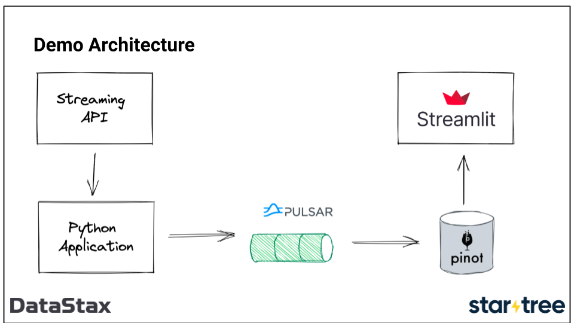

= Demo Script (Non Docker)

In this demo we'll show how to build a real-time analytics dashboard using Apache Kafka, Apache Pinot, and Streamlit.

== Setup

Download the Pinot binary from https://pinot.apache.org/download/.
Unpack the binary and start Pinot:

[source, bash]
----
tar -xvf apache-pinot-0.10.0-src.tar.gz
cd apache-pinot-0.10.0-bin
./bin/pinot-admin.sh QuickStart -type EMPTY
----

Download the Kafka binary from https://kafka.apache.org/quickstart.
Unpack the binary:

[source, bash]
----
tar -xvf kafka_2.13-3.1.1.tgz
cd kafka_2.13-3.1.1
----

[source, bash]
----
./bin/zookeeper-server-start.sh config/zookeeper.properties
----

[source, bash]
----
./bin/kafka-server-start.sh config/server.properties
----

Open up a new tab on the terminal and install Python dependencies:

[source, bash]
----
python -m venv .venv
source .venv/bin/activate
pip install sseclient-py confluent-kafka streamlit plotly pinotdb  pandas requests
----

== Wikimedia Recent Changes Feed

Wikimedia provides a continuous stream of structured event data describing changes made to Wikimedia properties.
Those events are published over HTTP using the Server-Side Events (SSE) Protocol.

The HTTP endpoint is https://stream.wikimedia.org/v2/stream/recentchange. 

You can open this endpoint up so that people can see what the data looks like.

We're going to query this end point using the Python SSE client. 

Open `wiki.py` to show the code used for querying this endpoint.
Most interesting are lines 10-13, which do most of the work.

Run the script:

[source, bash]
----
python wiki.py
----

We can see a stream of events, similar to those that we saw when we opened the endpoint in our browser.
So we've been able to process the events from the streaming API and now we need to get those events into Kafka.

== Ingesting events into Kafka

Next we're going to ingest events into Kafka.
For the purposes of this demo we want to have a topic with multiple partitions, so let's create that:

[source, bash]
----
./bin/kafka-topics.sh \
  --bootstrap-server localhost:9092 \
  --partitions 5 \
  --topic wiki_events \
  --create 
----

And let's do a quick check on the offsets for each of the partitions:

[source, bash]
----
./bin/kafka-run-class.sh kafka.tools.GetOffsetShell \
  --broker-list localhost:9092 \
  --topic wiki_events
----

All of them have a value of `0`, which is exactly what we're expect given we haven't imported any data yet.

Now let's have a look at the script that will ingest the events into Kafka.
Open `wiki_to_kafka.py`.

Interesting things to point out:

* The `while true` loop is to deal with the stream disconnecting, which seems to happen from time to time.
* The Kafka producer code that writes events to the topic
* The flushing code that ensures every 100 events are persisted to Kafka

Run the script:

[source, bash]
----
python wiki_to_kafka.py
----

You'll need to leave this running on your second tab so that events keep on ingesting for the rest of the demo.

Check that the offsets are now increasing:

[source, bash]
----
./bin/kafka-run-class.sh kafka.tools.GetOffsetShell \
  --broker-list localhost:9092 \
  --topic wiki_events
----

You can also optionally show that the events are flowing into Kafka:

[source, bash]
----
./bin/kafka-console-consumer.sh \
  --bootstrap-server localhost:9092 \
  --topic wiki_events
----

At this stage we've got the events from the streaming service into Kafka.
Next step: Pinot!

== Pinot

Explain that Pinot uses tables that are backed by a schema.
You can have the same schema for multiple tables if you want to - you might do this if you're testing out indexing strategies.

Both schemas and tables are specified using JSON config files.
Walk through `config/schema.json` and `config/table.json`

Interesting things to point out:

`config/schema.json`

* Explain the different field types: dimension, metric, timestamp
* Explain the different data types that we can use

`config/table.json`

* `tableIndexConfig.streamConfigs` - point out the Kafka topic name and broker
* `realtime.segment.flush.threshold.rows` is the threshold at which Pinot will flush a segment to the deep store. This is the threshold per server, so since we have 5 partitions on our server, we'll have 1000/5 = 200 rows per segment. This is way too small for a production case and is only for demo purposes.
* `ingestionConfig.transformConfigs` - explain that Pinot will map the fields to schema columns, but we can do some basic transformations without needing to rely on a streaming engine like Flink or Spark Streaming.

Add the table and schema:

[source, bash]
----
./bin/pinot-admin.sh AddTable \
  -tableConfigFile /path/to/pinot-wiki/config/table-local.json \
  -schemaFile /path/to/pinot-wiki/config/schema.json \
  -exec
----

Navigate to http://localhost:9000 and give a brief tour of the Pinot Explorer.
Show the query view and maybe a query or two to show that the data is still being ingested.

Navigate to the table view and click through to one of the consumed segments and talk a little about its meta data.

== Streamlit

Now to build our dashboard. 
We're going to use Streamlit, a Python based web framework.
They were recently acquired by Snowflake.

We'll be querying Pinot using the Python client and then using plotly to create some charts.

=== v1

The first version of the dashboard, `app_v1.py`, shows the changes that have been made in the last minute and the one before that.
Show them the query that uses aggregation + filtering to compute the number of changes, number of users, and number of domains

Run the app:

[source, bash]
----
streamlit run app_v1.py
----

Explain the indicators + charts.
You'll need to refresh the page to see the values change, which leads us nicely into v2.

=== v2

The second version of the dashboard.
This one has auto refresh, but is otherwise the same as the first one.

[source, bash]
----
streamlit run app_v2.py
----

By default it refreshes every 2 seconds, but you can adjust that.

=== v3

And finally the complete dashboard.
This one gives an overview of the changes, but also lets us drill down to see changes by type of user, domain, and actual user.
Disable the auto refresh before showing `Drill Down by User.`

[source, bash]
----
streamlit run app.py
----
